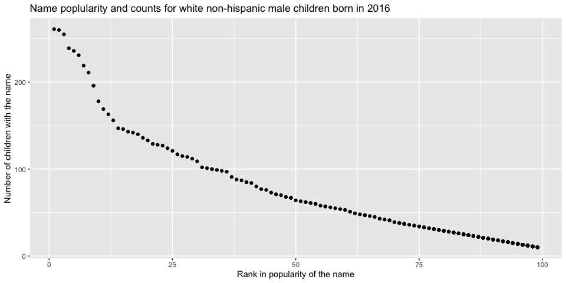

P8105 Homework 2
================
Junxian Chen ( jc5314 )
9/27/2019

# Problem 1

### Part 1. Read and clean the Mr. Trash Wheel sheet

Firstly, load nessary libraries:

``` r
library(tidyverse)
library(readxl)
```

Next, read in the data as `trash_wheel_data` and do the clean:

``` r
file_path = "./data/HealthyHarborWaterWheelTotals2018-7-28.xlsx"

trash_wheel_data = 
  read_excel(file_path, sheet = 'Mr. Trash Wheel', range = cell_cols("A:N")) %>%
  janitor::clean_names() %>%
  drop_na(dumpster) %>%
  mutate(
    sports_balls = as.integer(round(sports_balls))
  )
```

### Part 2. Read and clean precipitation data for 2017 and 2018

``` r
# Read and clean precipitation data for 2017

pre_2017_data = 
  read_excel(file_path, sheet = '2017 Precipitation', skip = 1) %>%
  janitor::clean_names() %>% 
  drop_na()  %>% 
  mutate(year = 2017)
```

``` r
# Read and clean precipitation data for 2018

pre_2018_data = 
  read_excel(file_path, sheet = '2018 Precipitation', skip = 1) %>%
  janitor::clean_names() %>% 
  drop_na() %>% 
  mutate(year = 2018)
```

``` r
# Combine precipitation datasets and convert month to a character variable

pre_2017_18 = 
  full_join(pre_2017_data, pre_2018_data) %>%
  mutate(month = month.name[month])
```

### Part 3. A brief summary about these data

The dataset `trash_wheel_data` which comes from the Mr. Trash Wheel
sheet has 285 observations. After omitting rows without precipitation
data and the sum value of the year, the dataset `pre_2017_data`, which
is the precipitation data for 2017, has 12 observations and the dataset
`pre_2018_data`, which is the precipitation data for 2018, has 7
observations. The combined precipitation dataset of 2017-18 has 19
observations.

For the dataset `trash_wheel_data` which comes from the Mr. Trash Wheel
sheet, the key variables I think should be the ‘**Month**’, ‘**Weight**’
and ‘**Volume**’ of each dumpster. Based on these variables, we can find
the trend of trash collection by Mr. Trash Wheel over time and how it
performance in different month. Also, the **precipitation value** of
each month in each year can be also considered as key variables. Because
from the dataset, we can find that the amount of trash Mr. Trash Wheel
receives is highly dependent on precipitation, which accords with the
description by the dirctor.

According to the data, the total precipitation in 2018 is 23.5 inch. The
median number of sports balls in a dumpster in 2017 is 8.

# Problem 2

### Part 1. Read and clean the datasets

``` r
# read in and clean the data from pols-month.csv

pols_data = 
  read_csv("./data/fivethirtyeight_datasets/pols-month.csv") %>%
  separate(mon, c('year', 'month', 'day'), convert = TRUE) %>%
  mutate(
    month = month.name[month],
    president = ifelse(prez_gop == 0, 'dem', 'gop'),
  ) %>%
  select(-c(day, prez_dem, prez_gop))
```

(Note: Because the `prez_gop` data from ‘1974/08/15- 1974/12/15’ is
recorded as `2` instead of `0` or `1`, I used `ifelse(prez_gop == 0,
'dem', 'gop')` in the code above to avoid dealing with `2` in the
classification.)

``` r
# read in and clean the data from snp.csv

snp_data = 
  read_csv("./data/fivethirtyeight_datasets/snp.csv") %>%
  separate(date, c('month', 'day', 'year'), convert = TRUE) %>%
  mutate(month = month.name[month]) %>%
  select(year, month, close)
```

``` r
# read in and clean the data from unemployment.csv

unemployment_data = 
  read_csv("./data/fivethirtyeight_datasets/unemployment.csv") %>%
  pivot_longer(
    Jan:Dec,
    names_to = 'month',
    values_to = 'unemployment rate'
  ) %>%
  mutate(
    month = month.name[match(month, month.abb)]
  ) %>%
  janitor::clean_names()
```

### Part 2. Merge the datasets

Merge dataset`snp` into `pols`:

``` r
pols_snp_merge = full_join(pols_data, snp_data, by = c('year', 'month'))
```

Then merge `unemployment` into the
results:

``` r
data_merge = full_join(pols_snp_merge, unemployment_data, by = c('year', 'month'))
```

### Part 3. A brief summary about these data

# Problem 3

### Part 1. Load and tidy the data

``` r
baby_name_data = 
  read_csv("./data/Popular_Baby_Names.csv") %>%
  janitor::clean_names() %>%
  distinct() %>%
  mutate(
    childs_first_name = str_to_title(childs_first_name),
    gender = str_to_title(gender),
    ethnicity = 
      str_to_title(
        ifelse(ethnicity ==  'BLACK NON HISP', 'BLACK NON HISPANIC',
          ifelse(ethnicity ==  'WHITE NON HISP', 'WHITE NON HISPANIC',
            ifelse(ethnicity == 'ASIAN AND PACI', 'ASIAN AND PACIFIC ISLANDER', ethnicity
            )
          )
        )
      )
  )
```

### Part 2. A table showing the rank in popularity of the name “Olivia” over time

``` r
olivia_popularity = 
  baby_name_data %>%
  arrange(year_of_birth) %>%
  filter(childs_first_name == 'Olivia' & gender == 'Female') %>%
  select('Baby`s Name' = childs_first_name , year_of_birth, 'Sex of the Baby' = gender, 
         'Mother`s Ethnicity' = ethnicity, rank) %>%
  pivot_wider(
    names_from = 'year_of_birth',
    values_from = 'rank'
  ) %>%
  rename('Rank in 2016' = '2016', 'Rank in 2015' = '2015', 'Rank in 2014' = '2014', 
         'Rank in 2013' = '2013', 'Rank in 2012' = '2012', 'Rank in 2011' = '2011')

# show the table

print.data.frame(olivia_popularity)
```

    ##   Baby`s Name Sex of the Baby         Mother`s Ethnicity Rank in 2011
    ## 1      Olivia          Female Asian And Pacific Islander            4
    ## 2      Olivia          Female         Black Non Hispanic           10
    ## 3      Olivia          Female                   Hispanic           18
    ## 4      Olivia          Female         White Non Hispanic            2
    ##   Rank in 2012 Rank in 2013 Rank in 2014 Rank in 2015 Rank in 2016
    ## 1            3            3            1            1            1
    ## 2            8            6            8            4            8
    ## 3           22           22           16           16           13
    ## 4            4            1            1            1            1

### Part 3. A table showing the most popular name among male children over time

``` r
popular_name_male = 
  baby_name_data %>%
  arrange(year_of_birth) %>%
  filter(gender == 'Male' & rank == '1') %>%
  select(childs_first_name, year_of_birth, 'Mother`s Ethnicity' = ethnicity) %>%
  pivot_wider(
    names_from = 'year_of_birth',
    values_from = 'childs_first_name'
  ) %>%
  rename('Most pop name in 2016' = '2016', 'Most pop name in 2015' = '2015', 'Most pop name in 2014' = '2014', 
         'Most pop name in 2013' = '2013', 'Most pop name in 2012' = '2012', 'Most pop name in 2011' = '2011')

# show the table

print.data.frame(popular_name_male)
```

    ##           Mother`s Ethnicity Most pop name in 2011 Most pop name in 2012
    ## 1 Asian And Pacific Islander                 Ethan                  Ryan
    ## 2         Black Non Hispanic                Jayden                Jayden
    ## 3                   Hispanic                Jayden                Jayden
    ## 4         White Non Hispanic               Michael                Joseph
    ##   Most pop name in 2013 Most pop name in 2014 Most pop name in 2015
    ## 1                Jayden                Jayden                Jayden
    ## 2                 Ethan                 Ethan                  Noah
    ## 3                Jayden                  Liam                  Liam
    ## 4                 David                Joseph                 David
    ##   Most pop name in 2016
    ## 1                 Ethan
    ## 2                  Noah
    ## 3                  Liam
    ## 4                Joseph

### Part 4. A scatter plot showing the number of children with a name against the rank in popularity

``` r
names_poplarity_plot =
  baby_name_data %>%
  filter(gender == 'Male', ethnicity == 'White Non Hispanic', year_of_birth == '2016') %>%
  ggplot(aes(x = rank, y = count)) +
  geom_point() +
  labs(x = 'Rank in popularity of the name', 
       y = 'Number of children with the name',
       title = 'Name poplularity and counts for male, white non-hispanic children born in 2016') 

# show the plot

names_poplarity_plot
```

<!-- -->
